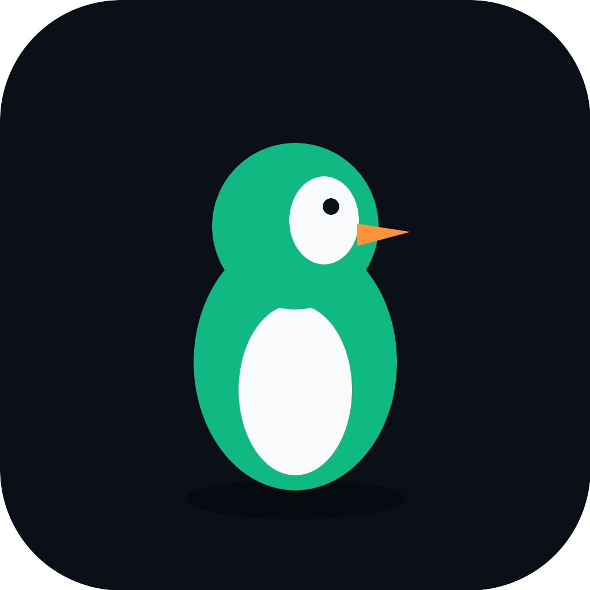

<p align="center">
  
</p>

<h1 align="center">AUK</h1>

<p align="center">
  <b>A desktop API client for people who'd rather not touch the mouse.</b>
  <br>
  Keyboard-first, git-native, and built around a few things most API clients treat as an afterthought —
  built-in load testing, an AI-agent-facing MCP server, and full multi-protocol support on one shared engine.
</p>

<p align="center">
  <a href="https://github.com/sandeepshekhar26/auk/releases/latest">⬇ Download for macOS</a>
  &nbsp;·&nbsp;
  <a href="docs/FEATURES.md">Full feature tour with screenshots</a>
</p>


Go backend ([Wails v2](https://wails.io)), SolidJS frontend — a real native app, not a browser tab.

---

## Why AUK

Postman, Insomnia, Yaak, and Bruno have the basics roughly covered — send a request, read a response, save
it to a collection. None of them is *delightful* to use, and most stop well short of the workflows that
actually slow teams down: load testing, CI gating, and letting an AI agent drive the tool safely instead of
you clicking through it by hand. That's the gap AUK is built into.

**The moat is the experience, not the checklist — features get copied, feel does not.** Every screen is held
to five rules (the full brief is [docs/05-ux-north-star.md](docs/05-ux-north-star.md)):

1. **Instant, always** — sub-second cold start; every interaction responds within one frame.
2. **Keyboard-first, mouse-optional** — `⌘K` reaches everything; a full request round-trip never needs the mouse.
3. **Density without clutter** — advanced options (proxy, mTLS, custom auth) are a keystroke away, never in your face.
4. **Best-in-class editing & inspection** — real syntax-aware editors, virtualized trees, response diffing.
5. **Zero-config, zero-surprise** — import and send immediately; nothing happens you didn't ask for.

On top of that, a handful of things most API clients simply don't have at all:

| | AUK | Most API clients |
|---|---|---|
| **Load testing** | Built-in [k6](https://k6.io) integration — live req/s + p95 charts, SLA thresholds, pass/fail verdicts, right next to the request you're already editing | A separate tool you reach for later, if ever |
| **AI agent access** | AUK *exposes itself* as an MCP server — Claude Code (or any MCP client) can list, run, and load-test your requests directly, with an approval prompt gating anything mutating. A built-in MCP **client** debugger also lets you inspect and test-invoke any other MCP server's tools | Rare or bolted on — Yaak shipped one, then deprecated it in favor of a CLI |
| **Storage** | Every workspace is plain YAML on disk — diff it, PR-review it, sync it with git or Dropbox. No account, no cloud, no login | Often cloud-first and account-gated, or an opaque local database |
| **Protocol coverage** | HTTP, WebSocket, SSE, GraphQL, and gRPC (reflection-based — no `.proto` files or precompiled stubs) all run through **one** headless engine, so the GUI, the CLI, the MCP server, and k6 script generation all execute *identically* | Protocols often bolted on unevenly across GUI and CLI |
| **CI story** | A headless CLI runs the exact same engine as the GUI, with declarative assertions and a non-zero exit code on failure — a real CI gate, not a reimplementation | GUI-first; the CLI (if any) is an afterthought |
| **Response diffing** | Diff the current response against the previous one, in-app, for free | Rarely offered at all |
| **Footprint** | A native OS webview (Wails) — no bundled Chromium | Several of the big names ship a full Electron runtime |

## Features

### Protocols
- **HTTP / REST** — redirects, custom methods, a full timing waterfall (DNS/connect/TLS/TTFB) and redirect-chain debugger, with insecure-downgrade warnings
- **GraphQL** — query + variables editor, plus a live schema explorer (fetched via introspection) — click any field to copy it
- **gRPC** — server reflection only, no `.proto` files or precompiled stubs needed; unary calls and server-streaming (with a live Connect/Disconnect console), client-streaming/bidi rejected with a clear message rather than a silent hang
- **WebSocket** — interactive console: connect/disconnect, a message composer, live frames
- **Server-Sent Events** — live, receive-only event stream
- **Batch send** — a ▶ button on any folder runs every request inside it (recursing into subfolders) and shows an aggregate pass/fail summary

### Auth
- Basic, Bearer, API Key, JWT
- OAuth 2.0 (client-credentials grant) and OAuth 1.0 (HMAC-SHA1, RFC 5849)
- AWS Signature v4
- Client certificates (mTLS), with custom CA and skip-verify in the same form
- Custom HTTP/HTTPS proxy — independent of TLS and auth, so any combination works together
- **1Password** — point any environment variable at an `op://vault/item/field` reference, resolved through your own `op` CLI at send time

### Templating, chaining & scripting
- `${uuid}`, `${timestamp.unix / iso8601 / format(...) / offset(...)}`, `${hash.md5 / sha1 / sha256}`, `${encode.base64 / base64url / url}`, `${cookie(name)}`, `${fs.read(...)}`
- Environment variables with folder-scoped overrides (closest folder wins, then its ancestors, then the workspace environment)
- Chain a value from a previous response by JSONPath — the referenced request auto-sends first if it hasn't run yet
- Pre-request scripting — sandboxed JavaScript (no filesystem/network/process access) that can read and reshape the request before it goes out

### Assertions & CI
- Declarative assertions — status / response time / header / JSON-path body value, each with `eq`/`neq`/`contains`/`matches`/`lt`/`gt`/`exists`/`notExists`
- Enforced identically in the GUI, the headless CLI (non-zero exit on failure), and over MCP — the same check that fails your build fails the request right here

### Response viewer
- Theme-aware JSON syntax highlighting, `⌘F` search, and diffing against the previous response
- A cookie jar per workspace — view, edit in place, delete, or manually add captured cookies
- JSONPath filter for narrowing down large bodies
- Code-snippet generation — "Copy as" cURL, Python (`requests`), JavaScript (`fetch`), or Go (`net/http`)

### k6 load testing
- Executor, virtual users, and duration config right next to the request you're already editing
- Live req/s + p95 chart as the test runs
- An authoritative end-of-test summary with SLA thresholds and a pass/fail verdict

### MCP (Model Context Protocol)
- **Embedded server** — expose your workspace to Claude Code or any MCP client over Streamable HTTP with a bearer token; mutating requests pop an in-app Allow/Deny prompt first
- **Client debugger** — connect to any other MCP server (stdio or HTTP), browse its published tools, and test-invoke them with a JSON-Schema-driven form

### Git & storage
- Every workspace is git-friendly YAML on disk — no database, no account, works with Dropbox or any file sync
- A built-in git panel — status, changed files, commit, commit + push, without dropping to a terminal
- Secrets live in the OS keychain, never in the synced files

### Import / export
- Import cURL, OpenAPI 3.x/Swagger 2.0, or a Postman Collection v2/2.1 — format auto-detected from pasted text
- Export a whole workspace as one portable JSON file (secret *values* are never included)
- Copy as cURL / paste cURL to round-trip individual requests

### UX & keyboard
- Command palette (`⌘K`) reaches every action — new request, switch environment, import, run history, settings
- A full keyboard round trip: new request → method → URL → header → send → inspect, no mouse required
- System / Light / Dark themes, self-hosted Inter + JetBrains Mono fonts (no CDN, no OS-default fallback)
- Environment color-coding, so a production environment is never one careless click away

## Screenshots & full tour

See **[docs/FEATURES.md](docs/FEATURES.md)** — every feature above, with real screenshots captured from a
running build (not mockups).

## Prerequisites

- Go 1.25+
- Node 20+ / npm
- [Wails v2 CLI](https://wails.io/docs/gettingstarted/installation)
- (optional, for load testing) a `k6` binary — see below

## Live development

```
wails dev
```

Runs the Go backend plus a Vite dev server with hot reload for the
frontend. The app also serves a plain-browser dev endpoint at
http://localhost:34115 with the same Go bindings available from devtools.

## Building

```
wails build
```

Produces a redistributable app under `build/bin/`. Configure product/build
metadata in `wails.json` — see the
[Wails project config reference](https://wails.io/docs/reference/project-config).

## k6 sidecar (load testing)

k6 is AGPL-3.0 licensed, so AUK never links or embeds it — it's invoked as an
arm's-length CLI subprocess, shipped unmodified. The binary isn't committed;
fetch the pinned version before building or running load tests:

```
build/sidecars/download-k6.sh macos-arm64
```

(Other targets: `macos-amd64`, `linux-amd64`, `linux-arm64`, `windows-amd64`.)
See [build/sidecars/README.md](build/sidecars/README.md) for the licensing
detail.

## Headless CLI

The same engine the GUI uses is also reachable headlessly, useful as a CI
smoke test:

```
apitool-cli run <requestID> --workspace-dir=DIR [--env=ENVIRONMENT_ID]
```

Assertions on the request (if any) determine the exit code.

## MCP server

AUK can expose itself as an MCP server (Settings → MCP Server) so Claude
Code or another MCP client can list workspaces/requests and run them
directly — see [docs/FEATURES.md](docs/FEATURES.md#embedded-mcp-server--let-claude-code-drive-the-app)
for details on the approval gating for mutating requests.
