# AUK — Features

AUK is a desktop API client (Wails + Go backend, SolidJS frontend) in the same
space as Postman/Insomnia/Yaak, built around three bets: **keyboard-first UX**,
**git-friendly on-disk storage** (every workspace is plain YAML you can diff
and PR-review), and a handful of features most API clients don't have —
built-in **k6 load testing**, an **embedded MCP server** (so Claude Code can
drive the app directly), and an **MCP client debugger** (so you can inspect
*any* MCP server's tools from inside AUK).

All screenshots below are real, captured from a running build — not mockups.
There's no screen-recorded demo video, but this looping GIF walks through
every feature below using those same screenshots:

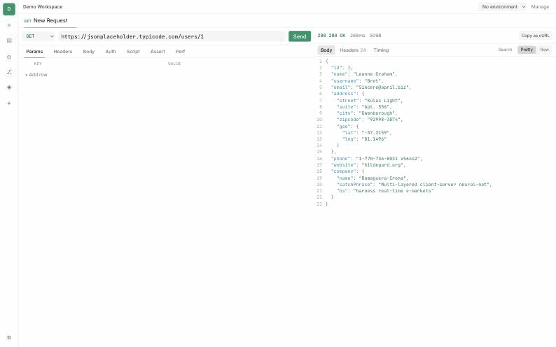

## Quick tour

### The basics: send a request, read the response

Light or dark, requests get syntax-highlighted, theme-aware JSON in the
response viewer — keys, strings, numbers, booleans, and `null` are each their
own color, driven by the same CSS variables the rest of the UI uses.

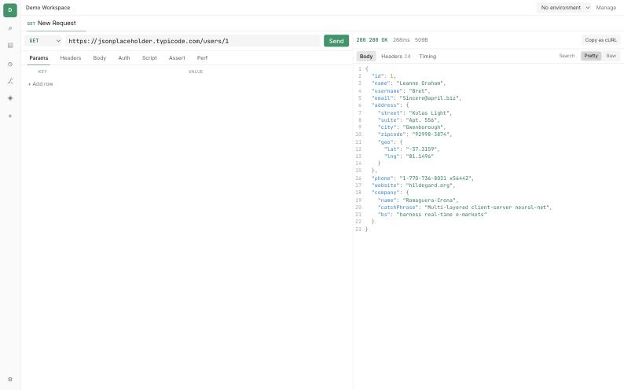

Every editor in the app (request body, response body, scripts, MCP tool
results) uses the same font stack: **Inter** for UI text and **JetBrains
Mono** for anything code-shaped, both bundled with the app (no network
fetch, no falling back to whatever the OS happens to ship).

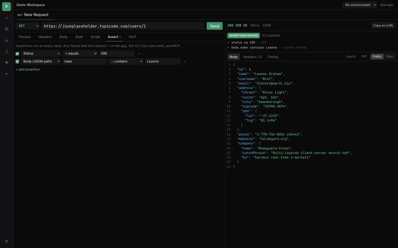

Theme is a first-class setting — System/Light/Dark, switchable from
`⌘,` or the command palette, persisted to `~/.auk/settings.yaml`.

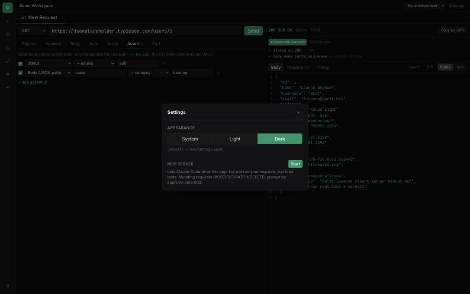

### Request debugger: where did the time go?

Every request captures a real `httptrace`-level timing breakdown — DNS
lookup, connect, TLS handshake, TTFB, content download — rendered as a
proportional waterfall. Redirects are captured too, since Go's HTTP client
calls the underlying transport once per hop.

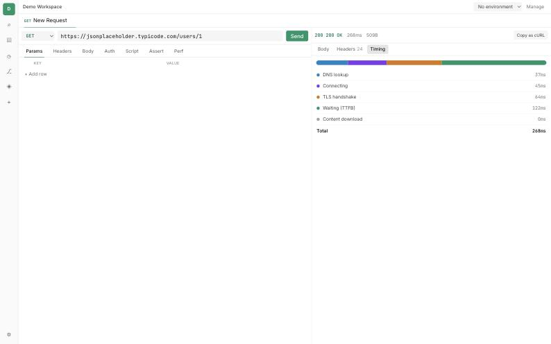

### Declarative assertions — a CI gate, not just a GUI toggle

Assertions (status / response time / header / JSON-path body value, each
with `eq`/`neq`/`contains`/`matches`/`lt`/`gt`/`exists`/`notExists`) run on
every send, in the GUI, the CLI (non-zero exit on failure), and over MCP.
The same check that fails your build fails the request right here.

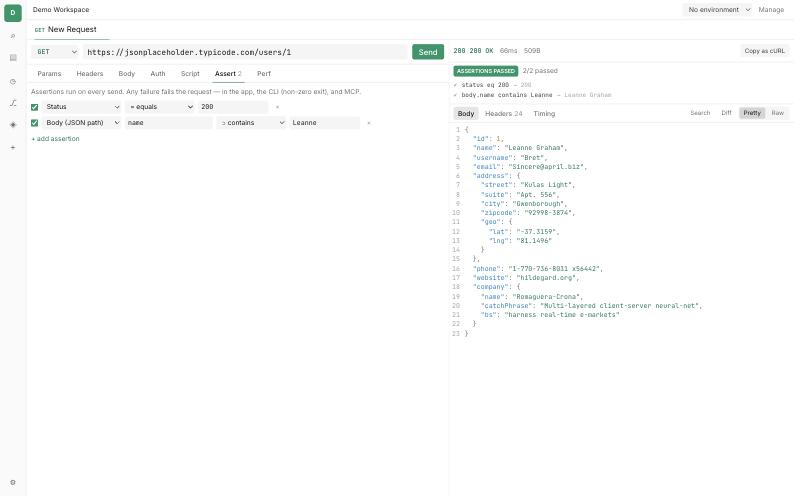

### Pre-request scripting

Templating (`${uuid}`, `${timestamp.iso8601}`, `${hash.sha256(...)}`,
`${encode.base64(...)}`, chaining off a previous response) covers the
common cases without any code. For everything else, a pre-request script
(real JavaScript, sandboxed — no filesystem/network/process access) can
read `ctx.request` and set headers before the request goes out:

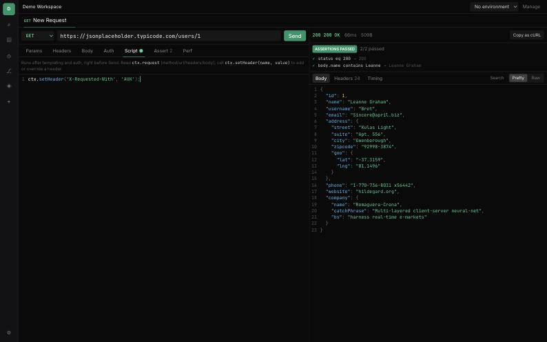

### k6 load testing, built in

AUK shells out to a real k6 binary (arm's-length CLI sidecar, not linked
into the binary — k6 is AGPLv3, so this is a deliberate boundary) and turns
any saved request into a load test: executor, virtual users, duration, and
SLA thresholds, right next to the request you're already editing.

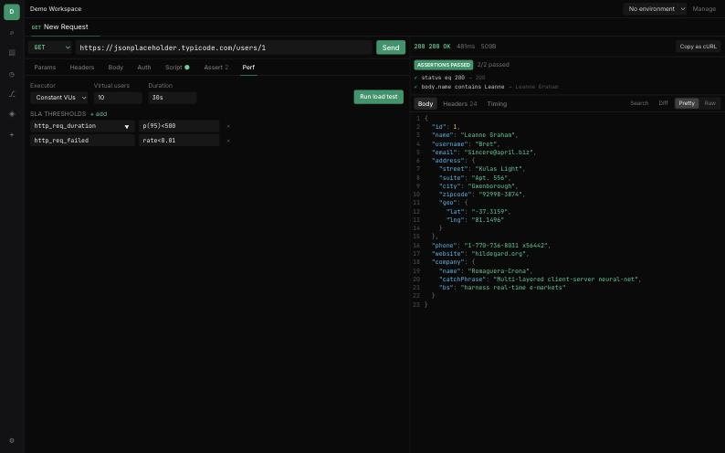

Results stream in live (req/s and p95 on the chart as the test runs) and
finish with an authoritative pass/fail verdict plus per-threshold detail —
this run hit real `jsonplaceholder.typicode.com` for 5 seconds at 3 VUs:

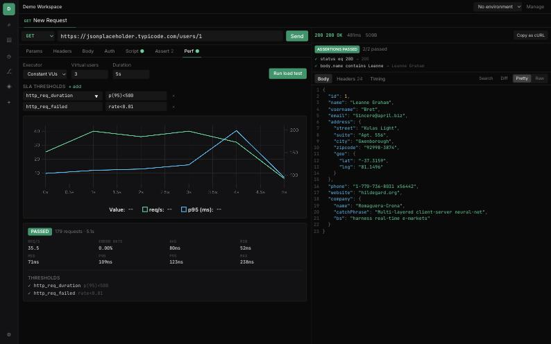

### Git collaboration, without leaving the app

Every workspace lives in `~/.auk/workspace` as git-friendly YAML. The Git
panel shows branch, dirty state, and changed files, and can commit (and
push, if a remote is configured) without dropping to a terminal.

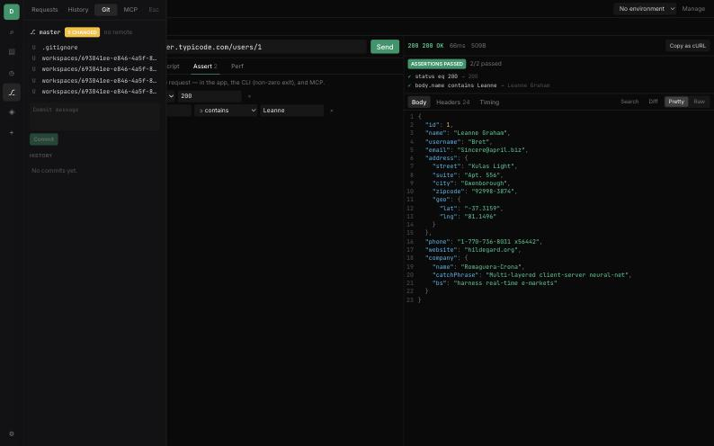

### Import: cURL, OpenAPI, or a Postman collection

Paste any of the three and AUK detects the format automatically, turning
an OpenAPI spec or Postman collection into a full workspace — folders,
requests, and environments — in one step.

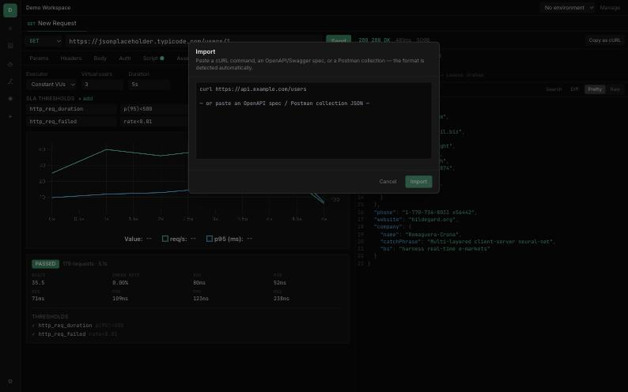

### Embedded MCP server — let Claude Code drive the app

Toggle it on in Settings and AUK exposes `list_workspaces`, `list_requests`,
`run_request`, and `run_perf_test` over Streamable HTTP on a fixed loopback
port with a bearer token. Mutating requests (POST/PUT/PATCH/DELETE)
triggered over MCP pop an in-app Allow/Deny prompt first — MCP can drive
the app, but can't silently mutate things behind your back.

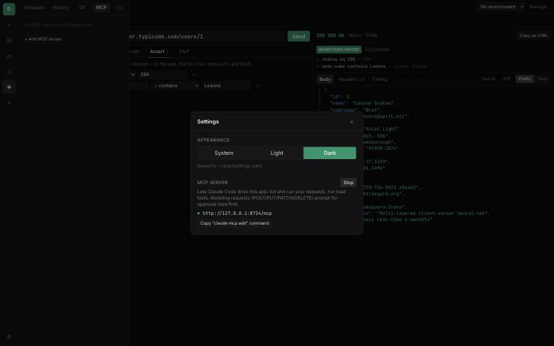

### MCP client debugger — inspect *any* MCP server

The mirror image of the server: AUK can also act as an MCP **client**,
connecting to your own MCP server (stdio subprocess or Streamable HTTP) to
browse its published tools and test-invoke them — like the official MCP
Inspector, but integrated into AUK. Here it's connected to its own embedded
server as a demo, showing all four published tools:

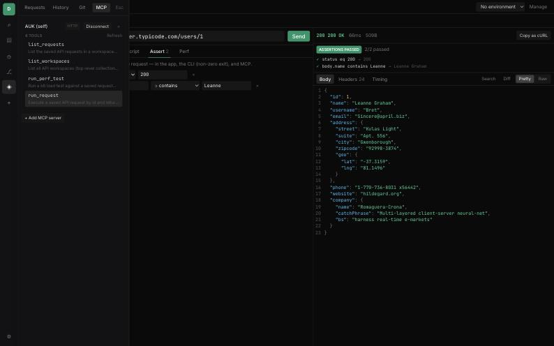

Invoking a tool shows the raw result and structured content side by side,
with a history of calls made this session:

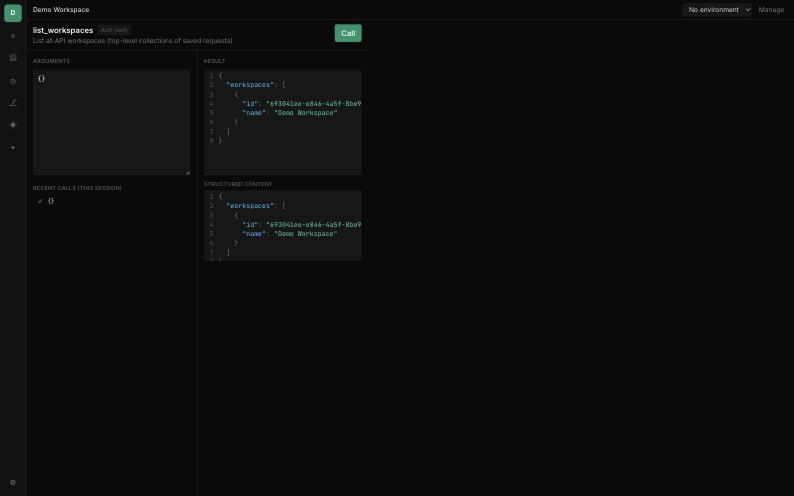

### Keyboard-first: the command palette

`⌘K` reaches everything — jump to a request, browse history, import,
switch theme, open settings — without leaving the keyboard. `⌘N` for a new
request, `⌘B` to browse, `⌘,` for settings.

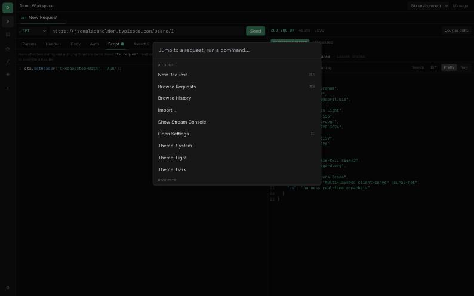

### The native app

AUK is a real macOS app (Wails v2), not just a browser tab:

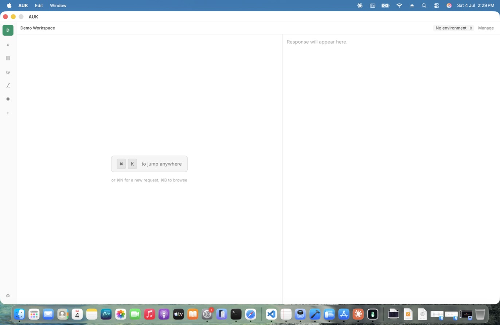

## Full feature list

**Protocols**: HTTP, WebSocket, SSE, GraphQL, and gRPC (server reflection —
no `.proto` files or precompiled stubs needed), all usable from the desktop
GUI via a protocol picker on the request. Each gets the right UI: an
interactive **WebSocket** console (connect/disconnect, a message composer,
live frames in the Stream Console); a live **SSE** event stream; a
**GraphQL** query + variables editor with a live schema explorer (fetched
via introspection, click a field to copy it); and a **gRPC** panel
(fully-qualified method + JSON request message) supporting both unary calls
and server-streaming (a live Connect/Disconnect console, same as WS/SSE) —
client-streaming/bidi are rejected with a clear message rather than a
silent hang. **Batch send**: a ▶ button on any folder runs every request
inside it (recursing into subfolders), with an aggregate pass/fail summary.
The same protocols also run headless via the CLI.

**Auth**: Basic, Bearer, API Key, JWT, OAuth 2.0 (client credentials),
OAuth 1.0 (HMAC-SHA1), AWS Signature v4, client certificates (mTLS, with
custom CA and skip-verify), a custom HTTP/HTTPS proxy (independent of auth
and TLS), and **1Password** — any environment variable's value can be an
`op://vault/item/field` reference, resolved through your own `op` CLI at
send time.

**Templating**: `${uuid}`, `${timestamp.unix / unixMillis / iso8601 / format(...) / offset(...)}`,
`${hash.md5 / sha1 / sha256(...)}`, `${encode.base64 / base64url / url(...)}`,
`${cookie(name)}`, `${fs.read(...)}`, environment variables (with
folder-scoped overrides — closest folder wins), and request chaining
(reference a previous response's JSON by path, auto-sending it first if it
hasn't run yet).

**Pre-request scripting**: sandboxed JavaScript (no I/O), read `ctx.request`,
call `ctx.setHeader(name, value)`, 2-second execution timeout.

**Assertions**: status / responseTime / header / body-JSON-path, each with
`eq`/`neq`/`contains`/`matches`/`lt`/`gt`/`exists`/`notExists`. Enforced
identically in the GUI, the CLI (non-zero exit), and over MCP.

**Import / export**: cURL, OpenAPI 3.x / Swagger 2.0 (JSON or YAML), Postman
Collection v2/2.1 — auto-detected from pasted text. Export a whole
workspace as one portable JSON file (secret values are never included).

**Response viewer**: theme-aware JSON syntax highlighting, `⌘F` search,
diff against the previous response, a JSONPath filter for large bodies,
headers, the timing/redirect tab, a per-workspace **cookie jar** (view,
edit, delete, or manually add captured cookies), and code-snippet
generation ("Copy as" cURL, Python, JavaScript, or Go).

**k6 performance testing**: executor + VUs + duration config, live req/s +
p95 chart, SLA thresholds, pass/fail verdict.

**Git collaboration**: status, changed files, commit, commit + push —
your workspace is a real git repo on disk the whole time.

**Embedded MCP server**: Streamable HTTP, loopback + bearer token,
`list_workspaces` / `list_requests` / `run_request` / `run_perf_test`,
with an approval prompt gating mutating requests.

**MCP client debugger**: connect to any MCP server (stdio or HTTP), browse
its tools, test-invoke them with a JSON-Schema-driven form.

**Theme**: System/Light/Dark, semantic CSS-variable tokens throughout (no
raw palette classes), self-hosted Inter + JetBrains Mono fonts,
environment color-coding to keep production unmistakable.

**Headless CLI**: `apitool-cli run <requestID> --workspace-dir=DIR
[--env=ENVIRONMENT_ID]` — runs the identical engine the GUI uses, so it's a
real CI smoke-test/regression runner, not a reimplementation.

## Architecture, briefly

One headless Go `core` engine (`internal/`) is shared by the GUI, the MCP
server, the MCP client, the CLI, and k6 script generation — there's a single
`Dispatch` chokepoint, so approval policy and assertions apply no matter
which of those five entry points sent the request. Workspaces are plain YAML
files (git-friendly by construction, not as an afterthought). k6 stays an
arm's-length CLI sidecar rather than a linked dependency, on purpose (it's
AGPLv3; the app is not).

## What's next

Plugin runtime, community themes, a durable response-body archive (for
cross-session diffing), gRPC client-streaming/bidi + `.proto` import,
GraphQL autocomplete-while-typing, NTLM auth (deliberately deferred — it
needs a challenge-response retry loop that doesn't fit this app's auth
model the way every other method here does), distributed k6, fuller git
(branch/merge/diff — today is status + log + commit + push), and MCP
resources/prompts (tools only, today).
