# AUK — Features

AUK is a desktop API client (Wails + Go backend, SolidJS frontend) in the same
space as Postman/Insomnia/Yaak, built around three bets: **keyboard-first UX**,
**git-friendly on-disk storage** (every workspace is plain YAML you can diff
and PR-review), and a handful of features most API clients don't have —
built-in **k6 load testing**, an **embedded MCP server** (so Claude Code can
drive the app directly), and an **MCP client debugger** (so you can inspect
*any* MCP server's tools from inside AUK).

All screenshots below are real, captured from a running build — not mockups.
**They predate the navigation redesign**: they show the old icon-glyph rail
and pop-over request drawer, while current builds have a docked, resizable
sidebar with color-coded method badges (see "Navigation" below). Everything
else in them is current. There's no screen-recorded demo video, but this
looping GIF walks through every feature below using those same screenshots:

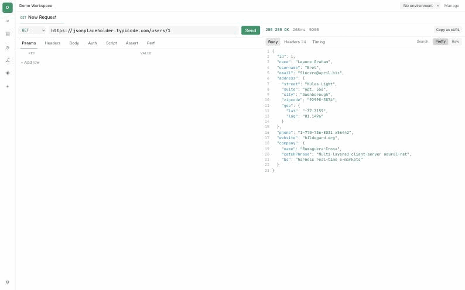

## Quick tour

### The basics: send a request, read the response

Light or dark, requests get syntax-highlighted, theme-aware JSON in the
response viewer — keys, strings, numbers, booleans, and `null` are each their
own color, driven by the same CSS variables the rest of the UI uses.

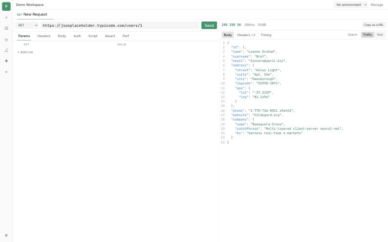

Every editor in the app (request body, response body, scripts, MCP tool
results) uses the same font stack: **Inter** for UI text and **JetBrains
Mono** for anything code-shaped, both bundled with the app (no network
fetch, no falling back to whatever the OS happens to ship).

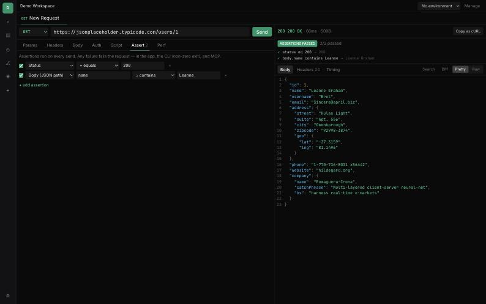

Theme is a first-class setting — System/Light/Dark, switchable from
`⌘,` or the command palette, persisted to `~/.auk/settings.yaml`.

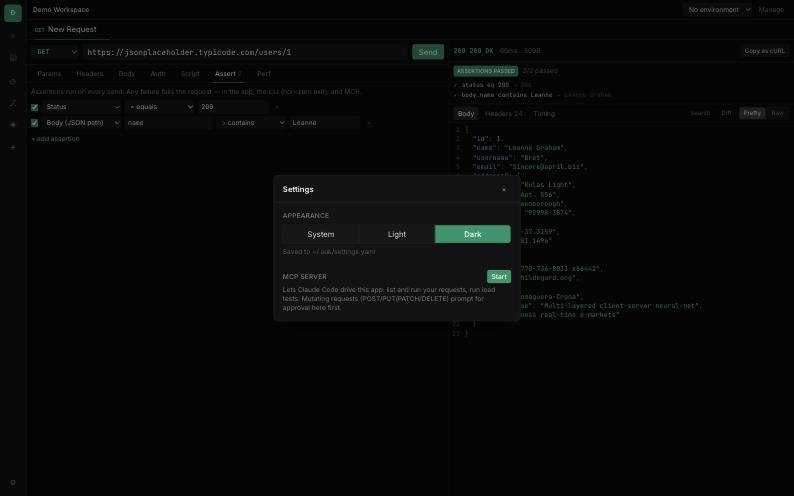

### Request debugger: where did the time go?

Every request captures a real `httptrace`-level timing breakdown — DNS
lookup, connect, TLS handshake, TTFB, content download — rendered as a
proportional waterfall. Redirects are captured too, since Go's HTTP client
calls the underlying transport once per hop.

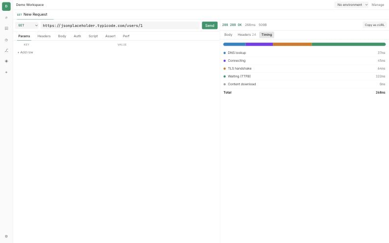

### Declarative assertions — a CI gate, not just a GUI toggle

Assertions (status / response time / header / JSON-path body value, each
with `eq`/`neq`/`contains`/`matches`/`lt`/`gt`/`exists`/`notExists`) run on
every send, in the GUI, the CLI (non-zero exit on failure), and over MCP.
The same check that fails your build fails the request right here.

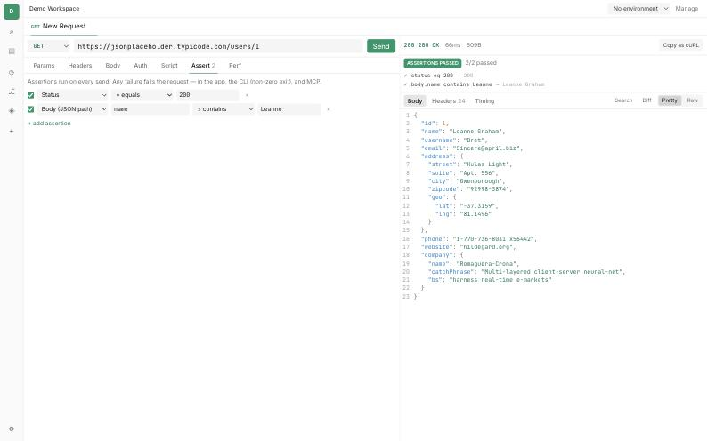

### Pre-request scripting

Templating (`${uuid}`, `${timestamp.iso8601}`, `${hash.sha256(...)}`,
`${encode.base64(...)}`, chaining off a previous response) covers the
common cases without any code. For everything else, a pre-request script
(real JavaScript, sandboxed — no filesystem/network/process access) can
read `ctx.request` and set headers before the request goes out:

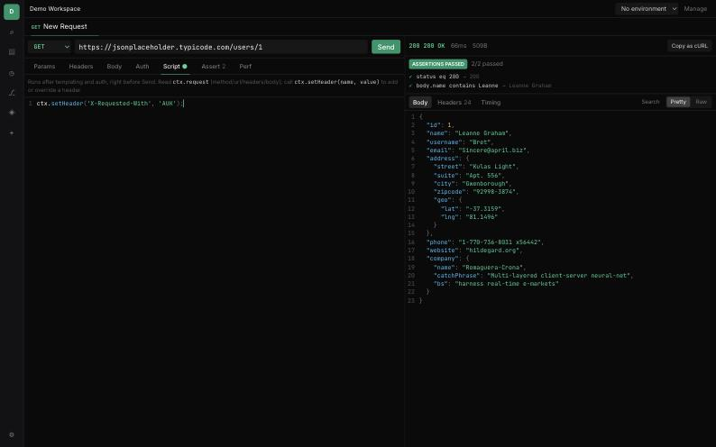

### k6 load testing, built in

AUK shells out to a real k6 binary (arm's-length CLI sidecar, not linked
into the binary — k6 is AGPLv3, so this is a deliberate boundary) and turns
any saved request into a load test: executor, virtual users, duration, and
SLA thresholds, right next to the request you're already editing.

k6 ships **inside the app** — the release bundles the unmodified official k6
v0.54.0 binary at `AUK.app/Contents/Resources/bin/k6` under AGPLv3, as a
separate program AUK only ever exec's (never linked, embedded, or
`xk6`-compiled), with its license and notice alongside it. There is nothing
to install; if a build ever arrives without it, the load-test panel offers a
one-click, checksum-verified download of the same pinned release.

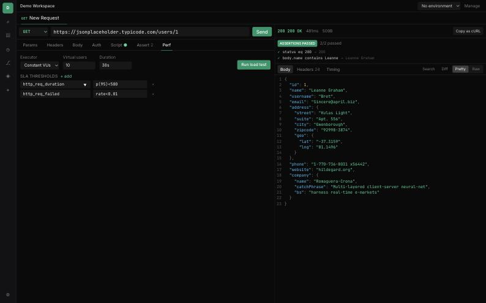

Results stream in live (req/s and p95 on the chart as the test runs) and
finish with an authoritative pass/fail verdict plus per-threshold detail —
this run hit real `jsonplaceholder.typicode.com` for 5 seconds at 3 VUs:

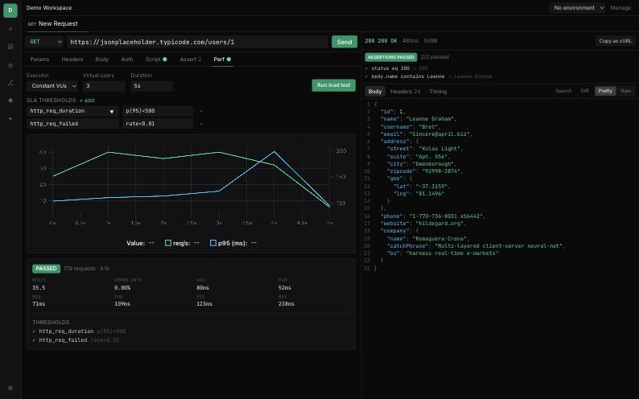

### Git collaboration, without leaving the app

Every workspace lives in `~/.auk/workspace` as git-friendly YAML. The Git
panel shows branch, dirty state, and changed files, and can commit (and
push, if a remote is configured) without dropping to a terminal.

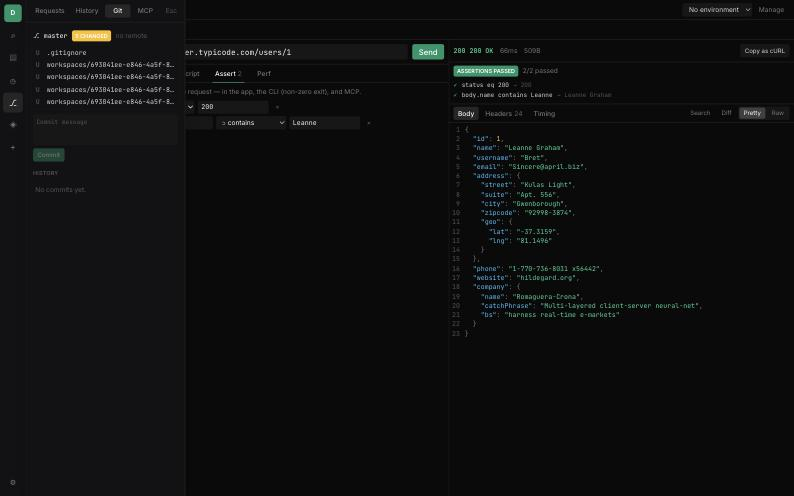

### Import: cURL, OpenAPI, or a Postman collection

Paste any of the three and AUK detects the format automatically, turning
an OpenAPI spec or Postman collection into a full workspace — folders,
requests, and environments — in one step.

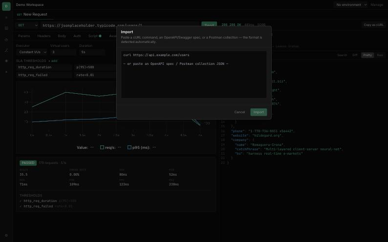

### Embedded MCP server — let Claude Code drive the app

Toggle it on in Settings and AUK exposes `list_workspaces`, `list_requests`,
`run_request`, and `run_perf_test` over Streamable HTTP on a fixed loopback
port with a bearer token. Mutating requests (POST/PUT/PATCH/DELETE)
triggered over MCP pop an in-app Allow/Deny prompt first — MCP can drive
the app, but can't silently mutate things behind your back.

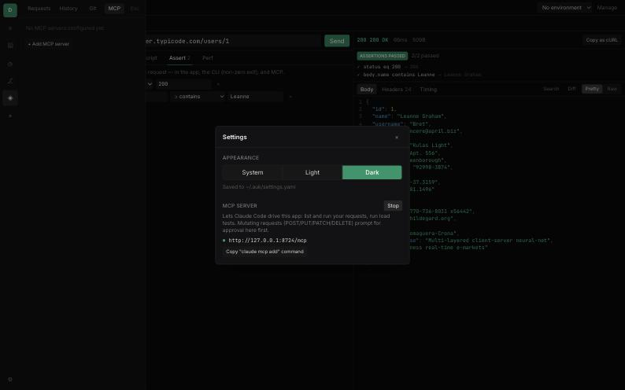

### MCP client debugger — inspect *any* MCP server

The mirror image of the server: AUK can also act as an MCP **client**,
connecting to your own MCP server (stdio subprocess or Streamable HTTP) to
browse its published tools and test-invoke them — like the official MCP
Inspector, but integrated into AUK. Here it's connected to its own embedded
server as a demo, showing all four published tools:

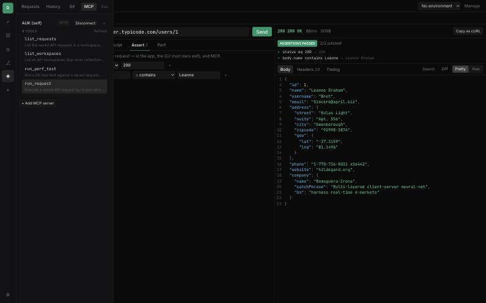

Invoking a tool shows the raw result and structured content side by side,
with a history of calls made this session:

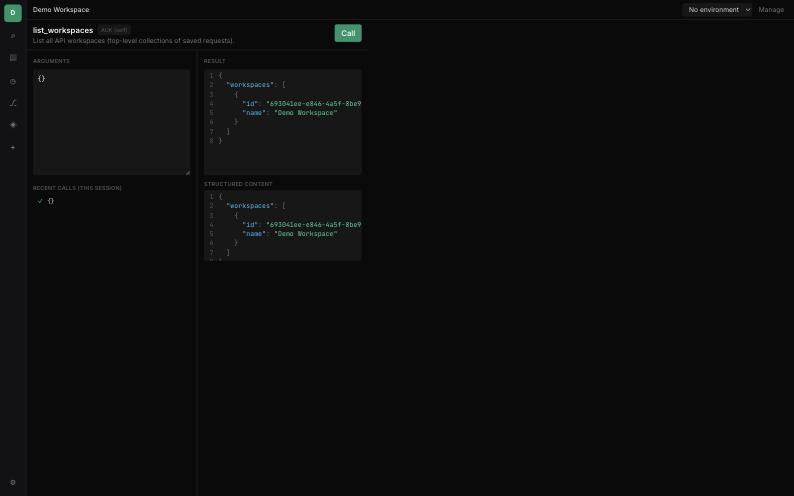

### Navigation: docked sidebar + icon rail

*(No screenshot yet — the images on this page predate this redesign.)*

A persistent, drag-resizable sidebar (the layout Postman/Insomnia/Yaak
users already know) sits next to a slim icon rail that switches its
sections: Requests, History, Git, MCP, Cookies. The request tree
color-codes every method (GET/POST/PUT/PATCH/DELETE each get a fixed hue;
WebSocket/GraphQL/SSE/gRPC show as protocol chips), supports full keyboard
navigation (↑↓→← to move and fold, Enter to open, F2 to rename, ⌘⌫ to
delete), right-click context menus (open, duplicate, rename, delete, new
request here, run folder), and drag & drop reordering — including dropping
a request onto a folder to move it inside. `⌘B` collapses the sidebar;
picking a request keeps it open. Purists can switch the sidebar to the
original auto-hiding **overlay mode** with the pin toggle in its header
(persisted in settings).

### Keyboard-first: the command palette

`⌘K` reaches everything — jump to a request, run a command (new request or
folder, duplicate, toggle sidebar, import, switch theme, open settings) —
without leaving the keyboard. `⌘N` for a new request, `⌘B` to toggle the
sidebar, `⌘,` for settings.

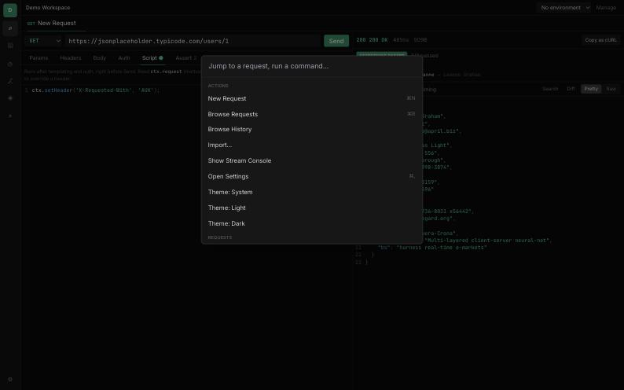

### The native app

AUK is a real macOS app (Wails v2), not just a browser tab:

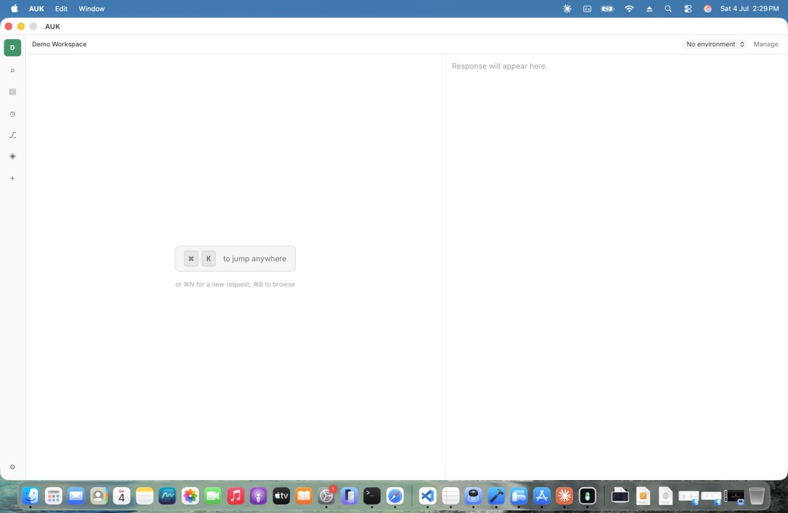

## Full feature list

**Protocols**: HTTP, WebSocket, SSE, GraphQL, and gRPC (server reflection —
no `.proto` files or precompiled stubs needed), all usable from the desktop
GUI via a protocol picker on the request. Each gets the right UI: an
interactive **WebSocket** console (connect/disconnect, a message composer,
live frames in the Stream Console); a live **SSE** event stream; a
**GraphQL** query + variables editor with a live schema explorer (fetched
via introspection, click a field to copy it); and a **gRPC** panel
(fully-qualified method + JSON request message) supporting both unary calls
and server-streaming (a live Connect/Disconnect console, same as WS/SSE) —
client-streaming/bidi are rejected with a clear message rather than a
silent hang. **Batch send**: a ▶ button on any folder runs every request
inside it (recursing into subfolders), with an aggregate pass/fail summary.
The same protocols also run headless via the CLI.

**Auth**: Basic, Bearer, API Key, JWT, OAuth 2.0 (client credentials + authorization code with PKCE via the system browser), AWS SigV4 (pasted keys or an AWS CLI profile/SSO),
OAuth 1.0 (HMAC-SHA1), AWS Signature v4, client certificates (mTLS, with
custom CA and skip-verify), a custom HTTP/HTTPS proxy (independent of auth
and TLS), and **1Password** — any environment variable's value can be an
`op://vault/item/field` reference, resolved through your own `op` CLI at
send time.

**Templating**: `${uuid}`, `${timestamp.unix / unixMillis / iso8601 / format(...) / offset(...)}`,
`${hash.md5 / sha1 / sha256(...)}`, `${encode.base64 / base64url / url(...)}`,
`${cookie(name)}`, `${fs.read(...)}`, environment variables (with
folder-scoped overrides — closest folder wins), and request chaining
(reference a previous response's JSON by path, auto-sending it first if it
hasn't run yet).

**Pre-request scripting**: sandboxed JavaScript (no I/O), read `ctx.request`,
call `ctx.setHeader(name, value)`, 2-second execution timeout.

**Assertions**: status / responseTime / header / body-JSON-path, each with
`eq`/`neq`/`contains`/`matches`/`lt`/`gt`/`exists`/`notExists`. Enforced
identically in the GUI, the CLI (non-zero exit), and over MCP.

**Import / export**: cURL, OpenAPI 3.x / Swagger 2.0 (JSON or YAML), Postman
Collection v2/2.1 — auto-detected from pasted text. Export a whole
workspace as one portable JSON file (secret values are never included).

**Response viewer**: theme-aware JSON syntax highlighting, `⌘F` search,
diff against the previous response, a JSONPath filter for large bodies,
headers, the timing/redirect tab, a per-workspace **cookie jar** (view,
edit, delete, or manually add captured cookies), and code-snippet
generation ("Copy as" cURL, Python, JavaScript, or Go).

**k6 performance testing**: executor + VUs + duration config, live req/s +
p95 chart, SLA thresholds, pass/fail verdict.

**Git collaboration**: status, changed files, commit, commit + push —
your workspace is a real git repo on disk the whole time.

**Embedded MCP server**: Streamable HTTP, loopback + bearer token,
`list_workspaces` / `list_requests` / `run_request` / `run_perf_test`,
with an approval prompt gating mutating requests.

**MCP client debugger**: connect to any MCP server (stdio or HTTP), browse
its tools, test-invoke them with a JSON-Schema-driven form.

**Navigation**: docked, resizable sidebar (default) or auto-hiding overlay
drawer (opt-in, persisted per machine); icon rail for section switching;
color-coded method badges and protocol chips; tree keyboard navigation,
inline rename, right-click context menus, and drag & drop reordering
persisted via fractional order keys (a reorder is a one-file YAML diff).

**Theme**: System/Light/Dark, semantic CSS-variable tokens throughout (no
raw palette classes), self-hosted Inter + JetBrains Mono fonts,
environment color-coding to keep production unmistakable.

**Headless CLI**: `apitool-cli run <requestID> --workspace-dir=DIR
[--env=ENVIRONMENT_ID]` — runs the identical engine the GUI uses, so it's a
real CI smoke-test/regression runner, not a reimplementation.

## Architecture, briefly

One headless Go `core` engine (`internal/`) is shared by the GUI, the MCP
server, the MCP client, the CLI, and k6 script generation — there's a single
`Dispatch` chokepoint, so approval policy and assertions apply no matter
which of those five entry points sent the request. Workspaces are plain YAML
files (git-friendly by construction, not as an afterthought). k6 stays an
arm's-length CLI sidecar rather than a linked dependency, on purpose (it's
AGPLv3; the app is not).

## What's next

Plugin runtime, community themes, a durable response-body archive (for
cross-session diffing), gRPC client-streaming/bidi + `.proto` import,
GraphQL autocomplete-while-typing, NTLM auth (deliberately deferred — it
needs a challenge-response retry loop that doesn't fit this app's auth
model the way every other method here does), distributed k6, fuller git
(branch/merge/diff — today is status + log + commit + push), and MCP
resources/prompts (tools only, today).

## In-app auto-update

AUK updates itself. On launch (opt-out, default on) it asks the GitHub
Releases API whether a newer signed DMG exists; if so, a slim dismissible
banner offers **Update**. One click downloads the DMG, **verifies it end to
end** — checksum (when the release publishes one), code-signature integrity,
that it carries *our* Developer ID Team ID (`V8SAC4GCQQ`), and Apple
notarization — then swaps the verified bundle in and relaunches. Anything not
signed by our Developer ID and notarized is refused: the Team-ID/notarization
check, not a checksum, is the real anti-tamper guarantee (an attacker in the
download path could forge a matching hash, but not a notarized bundle under our
Team ID). If AUK can't replace itself in place (an unwritable location), it
falls back to opening the verified DMG for a manual drag-install — never a
silent failure. Dev builds never nag (the running version is read from the
bundle's `CFBundleShortVersionString`; a `wails dev` build and any `0.0.0-dev`
build both read as "not behind"). The feed is behind an abstraction so a
self-hosted **signed appcast** can replace GitHub Releases later without
touching the download/verify/UI code. See [07-auto-update.md](07-auto-update.md).

## Response preview & save

The response viewer renders more than text. When a response comes back as an
image (`image/png`, `image/jpeg`, `image/gif`, `image/webp`, `image/svg+xml`)
it's shown inline as an actual image; when it's `text/html` it's rendered in a
**fully sandboxed** iframe (`sandbox=""` — no scripts, no forms, no same-origin
access, so a returned page can never execute JS in the app's own origin). The
rich preview is auto-selected from the `Content-Type`, with a one-click
**Preview / Raw** toggle back to the syntax-highlighted source at any time — the
pretty/raw JSON view, the JSONPath filter, diff-vs-previous, and in-body search
all stay exactly as they were for every other content type.

**Save response body**: a **Save** button in the response toolbar writes the
decoded body to a file through a native save dialog. The default filename comes
from the request name plus an extension guessed from the response
`Content-Type` (`.json`, `.html`, `.png`, `.svg`, `.xml`, `.txt`, …). The
decode-and-write runs in Go against the backend's stored last response, so no
base64 blob is round-tripped back down just to save it.

**Postman import — path variables**: importing a Postman collection now maps a
URL's `:name` path variables (Postman's per-URL `variable` array) into AUK's
Path params. An imported `/users/:id` request lands with its `id` Path row
pre-filled from the collection, and the raw URL keeps its `:id` tokens so the
editor's derived rows and the imported values line up.

## Mock server

A frontend team is blocked on one of two things: the API doesn't exist yet, or
it's down. AUK already holds the thing that unblocks them — the responses the
backend actually returned. **Settings → Mock Server → Start** puts them on
`http://127.0.0.1:8725`, and the frontend points its `.env` there.

No fixture files, no schema, no separate mocking tool that drifts from
reality: the mock **is** the last real response. Send a request once in AUK
and it's mocked. Re-send it and the mock updates on the very next hit — the
route table is derived live from the store on every incoming request, so a
changed status, body, or header lands without a restart, and a brand-new
request appears as a new route the moment it's sent.

Routes come from each saved request's URL: `METHOD` plus the path portion,
with `${var}` and `:param` segments treated as **wildcards** matching any
single segment (`${baseUrl}/users/:id` → `GET /users/:id`, which serves
`/users/42`). Query strings are ignored for routing. Most-specific wins, so a
recorded `/users/me` beats `/users/:id`. A known path under an unrecorded
method returns **405 with `Allow`**; anything unknown returns a **404 that
tells you what to do** — `{"error":"no mock for GET /x","hint":"send the
request once in AUK to record a mock"}`.

Replay is faithful: exact status, exact body, headers verbatim (repeats
preserved, so `Set-Cookie` survives) — minus hop-by-hop headers, with
`Content-Length` recomputed and `Date` regenerated. **CORS is unconditional**,
including on the 404s and 405s (a frontend must be able to *read* the error,
not have it hidden behind a CORS failure), and `OPTIONS` preflights are
answered `204` even for unknown paths so the browser surfaces the real status.
Every response carries `X-AUK-Mock: 1`, so "is this the mock or the real API?"
is one glance at devtools. Loopback-only and never auto-started — a mock full
of a team's real API data shouldn't bind a port on its own or be reachable
from the network the laptop is on. See
[10-mock-server.md](10-mock-server.md).

## HTTP Digest auth (RFC 7616)

Digest is what on-prem and enterprise APIs use — along with a very large
number of routers, IP cameras, NAS boxes, and other appliances whose admin
API is the only interface they have. It is also the one scheme that does not
fit AUK's "compute a header, attach it, send" auth model, because the reply
hashes a nonce the server has not issued yet. So AUK implements it where it
actually belongs: at the transport layer, as a **two-shot handshake**. The
request goes out once, the server answers `401` with a `WWW-Authenticate:
Digest` challenge, and AUK re-sends the *same* request — same method, URL,
headers, and body — carrying the computed `Authorization`.

Pick **Digest Auth** in the Auth tab and fill in a username and password;
everything else is negotiated from the challenge.

**Algorithms**: `MD5`, `SHA-256`, and `SHA-512-256`, plus each one's `-sess`
variant, and the MD5 default a challenge that omits `algorithm` implies.
**qop**: `auth`, and the qop-less RFC 2069 construction that older appliances
still emit. `auth-int` is not supported; a server offering only `auth-int`
gets its `401` passed straight through rather than a silent failure. When a
server offers several challenges at once, AUK answers the strongest one it
can actually compute.

Three behaviours worth knowing:

- **The retry is visible.** Both round-trips show up in the request
  debugger's hop chain — `401` then `200` — and the timing breakdown
  describes the authorized hop whose body you are reading. The challenge is
  real network traffic, so AUK shows it rather than hiding a doubled
  round-trip.
- **Bodies survive the handshake.** A `POST`/`PUT` body is made replayable
  *before* the first attempt, so the retry carries the identical payload.
- **Exactly one retry, ever.** A second `401` means the credentials are
  wrong, and that `401` is what you see. AUK will not loop against an
  endpoint that may have an account-lockout policy behind it.
